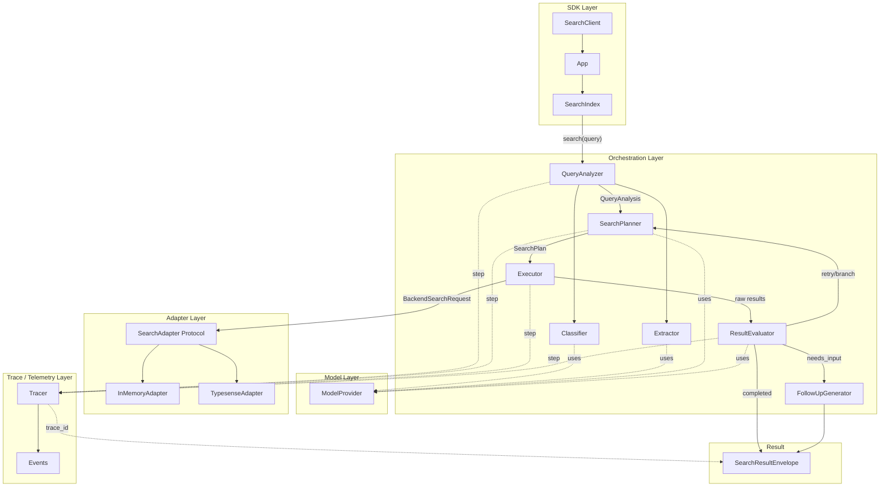

# Architecture -- Runtime Data Flow

## Data Flow Summary

1. **Developer calls** `index.search("show me Telstra stuff")`
2. **SDK Layer** routes the request to the orchestration pipeline
3. **QueryAnalyzer** classifies the query and extracts entities/filters using the Model Layer
4. **SearchPlanner** decides the action: direct search, search+filters, multi-branch, or needs_clarification
5. **Executor** translates the plan into a backend request via the Adapter Protocol
6. **ResultEvaluator** assesses the results and decides: completed, needs_input, or retry
7. **Tracer** captures each step for observability
8. **SearchResultEnvelope** is returned with status, results, branches, and trace_id
