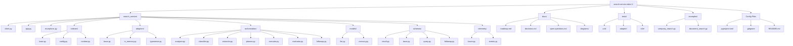

# Project Structure

```mermaid
graph TD
    ROOT["search-service-take-1/"]

    ROOT --> PKG["search_service/"]
    ROOT --> DOCS["docs/"]
    ROOT --> TESTS["tests/"]
    ROOT --> EXAMPLES["examples/"]
    ROOT --> CONFIG["Config Files"]

    PKG --> CLIENT["client.py"]
    PKG --> APP["app.py"]
    PKG --> EXCEPTIONS["exceptions.py"]
    PKG --> INDEXES["indexes/"]
    PKG --> ADAPTERS["adapters/"]
    PKG --> ORCHESTRATION["orchestration/"]
    PKG --> MODELS["models/"]
    PKG --> SCHEMAS["schemas/"]
    PKG --> TELEMETRY["telemetry/"]

    INDEXES --> IDX_BASE["base.py"]
    INDEXES --> IDX_CONFIG["config.py"]
    INDEXES --> IDX_RUNTIME["runtime.py"]

    ADAPTERS --> ADP_BASE["base.py"]
    ADAPTERS --> ADP_MEM["in_memory.py"]
    ADAPTERS --> ADP_TS["typesense.py"]

    ORCHESTRATION --> ORC_ANALYZER["analyzer.py"]
    ORCHESTRATION --> ORC_CLASSIFIER["classifier.py"]
    ORCHESTRATION --> ORC_EXTRACTOR["extractor.py"]
    ORCHESTRATION --> ORC_PLANNER["planner.py"]
    ORCHESTRATION --> ORC_EXECUTOR["executor.py"]
    ORCHESTRATION --> ORC_EVALUATOR["evaluator.py"]
    ORCHESTRATION --> ORC_FOLLOWUP["followup.py"]

    MODELS --> MOD_LLM["llm.py"]
    MODELS --> MOD_MERCURY["mercury.py"]

    SCHEMAS --> SCH_RESULT["result.py"]
    SCHEMAS --> SCH_TRACE["trace.py"]
    SCHEMAS --> SCH_QUERY["query.py"]
    SCHEMAS --> SCH_FOLLOWUP["followup.py"]

    TELEMETRY --> TEL_TRACER["tracer.py"]
    TELEMETRY --> TEL_EVENTS["events.py"]

    DOCS --> ROADMAP["roadmap.md"]
    DOCS --> DECISIONS["decisions.md"]
    DOCS --> OPENQ["open-questions.md"]
    DOCS --> DIAGRAMS["diagrams/"]

    TESTS --> TEST_UNIT["unit/"]
    TESTS --> TEST_ADAPTER["adapter/"]
    TESTS --> TEST_E2E["e2e/"]

    EXAMPLES --> EX_COMPANY["company_search.py"]
    EXAMPLES --> EX_DOC["document_search.py"]

    CONFIG --> PYPROJECT["pyproject.toml"]
    CONFIG --> GITIGNORE[".gitignore"]
    CONFIG --> README["README.md"]
```
